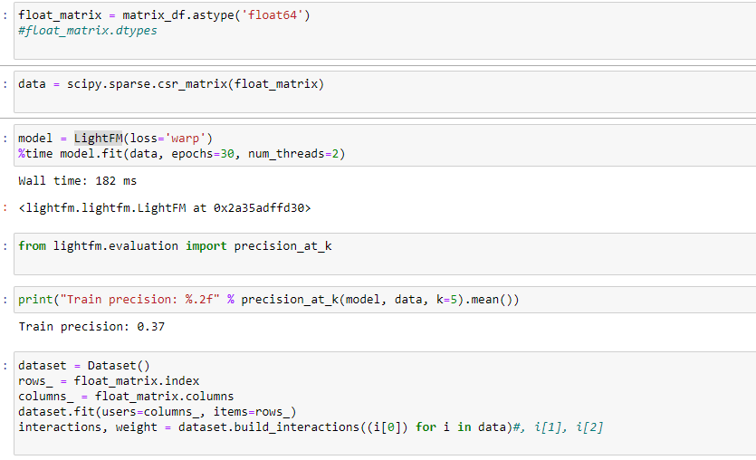

# Steam Game Recommender
 A Machine Learning Project

The goal is to create a recommendation system using the LightFM ML library.

To do:
1. construct item-item matrix for games based on genre, length, price, average-time-invested, etc.
2. construct a front end webpage to query steam_id numbers and display recommendations
3. redo powerpoint presentation to include ML results
4. acquire more steam users to improve overall recommendation system
5. construct additional matricies where useful

As it is now, my project still needs several layers of polish. I had very high hopes for this project and I believe I can turn it into something valuable, but at the moment it just barely meets project requirements. 

I need to get more data for each user and each item, then the model will improve signifcantly and I can work on displaying things in an appealing way.
